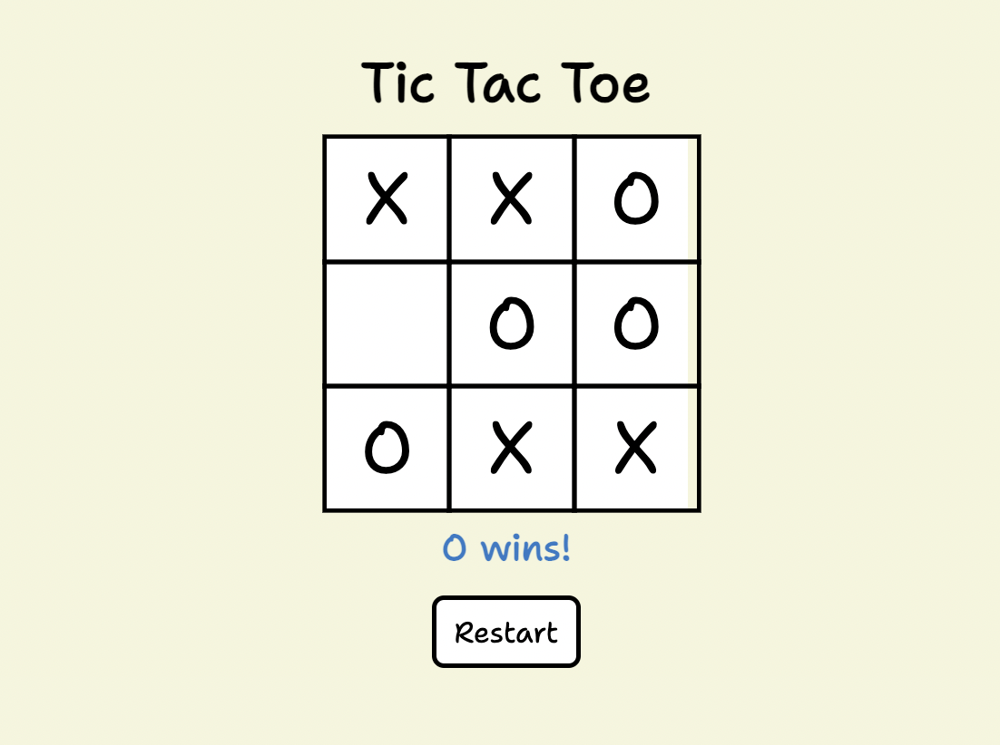
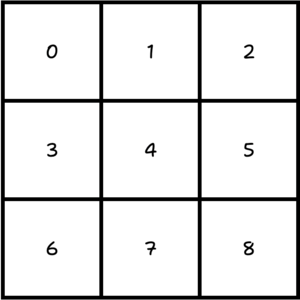
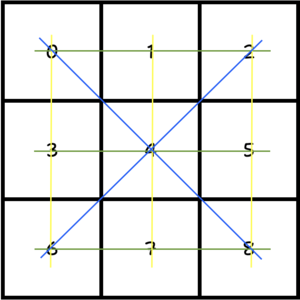

# Tic Tac Toe

**Live Demo**: https://mia-tictactoe.netlify.app/

## 代码逻辑
1. 用数字**0-8**从左到右，从上到下标记3x3棋盘的每个格子。将其视为数组的index。
    
2. 定义空字符串数组`option[]`代表玩家的选择，在游戏开始前，`option[]`数组里是9个空字符串：`option["", "", "", "", "", "", "", "", ""];`
3. 定义一个`currentPlayer`，在游戏开始前默认先手是`currentPlayer = "X"`，用`changePlayer()`函数改变当前的玩家为`O`，并反复改变当前玩家。
2. 定义`cellChecked()`函数存储玩家点击的格子的index，改变`option[index]`为`currenPlayer`。
3. 赢下游戏的条件是[0, 1, 2], [3, 4, 5], [6, 7, 8], [0, 3, 6], [1, 4, 7], [2, 5, 8], [0, 4, 8], [2, 4, 6]8种位置的字符同为`X`，或同为`O`
    
4. 定义`checkWinner()`函数检查在这些位置的字符是否同为`X`或同为`O`
    - 如果相同，则得出赢家；
    - 如果有空字符串，则继续游戏；
    - 如果没有空字符串，且这些位置的字符都不同时等于`X`或`O`，则得出平局。